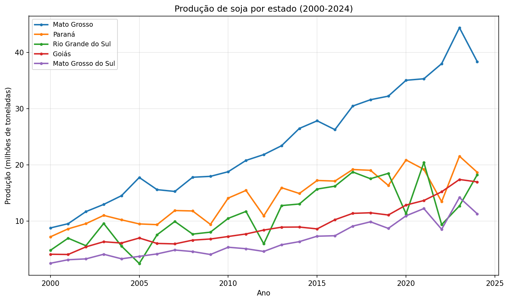
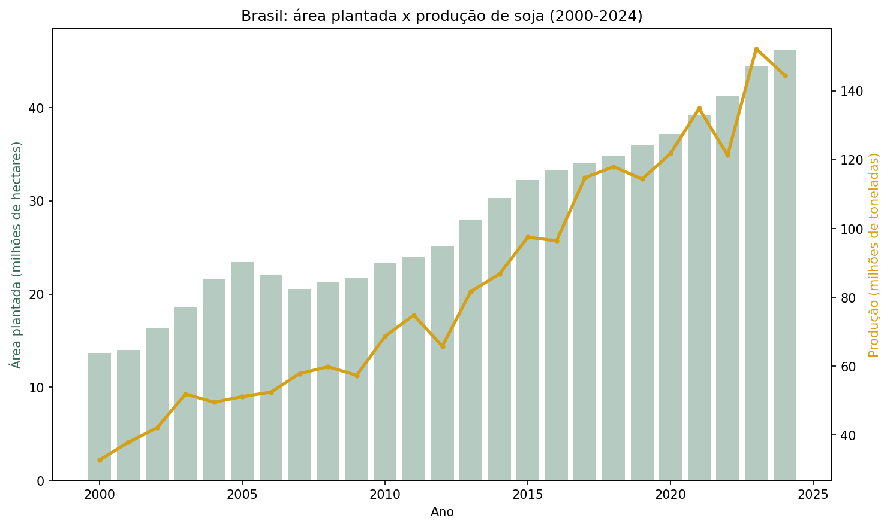

# Pipeline de Ingestão de Produção de Soja (IBGE/SIDRA)

Pipeline automatizado que verifica, valida e ingere dados oficiais de produção agrícola de soja do IBGE, rodando sozinho de forma agendada, sem intervenção manual. Projeto de portfólio focado em engenharia de dados: o produto aqui não é um modelo, é o cano por onde o dado passa de forma confiável.

## Por que esse projeto

Outros projetos deste portfólio demonstram ciência de dados aplicada: pegar um dataset e extrair valor preditivo dele. Este demonstra a etapa anterior, que normalmente é invisível: como um dataset confiável chega a existir e se mantém atualizado sem alguém baixando arquivo manualmente toda vez que precisa.

## Fonte de dado

API SIDRA do IBGE (Sistema IBGE de Recuperação Automática), tabela 1612 (Produção Agrícola Municipal), série histórica de produção de soja por Unidade da Federação: área plantada, área colhida, quantidade produzida e valor da produção, com dados desde 1974.

Diferente de portais que carregam planilha via JavaScript (o que inviabiliza automação simples), a SIDRA é uma API REST de verdade, documentada oficialmente, que responde em JSON puro.

## Arquitetura

```
GitHub Actions (agendador)
        │
        ▼
scripts/pipeline.py
        │
        ├── consulta a API SIDRA (tabela 1612, soja, todas as UFs, todos os anos)
        ├── valida schema e taxa de valores não numéricos
        ├── transforma e limpa
        └── grava em data/producao_soja.parquet (versionado no próprio Git)
```

Optei por rodar isso via GitHub Actions em vez de AWS, o que mantém o projeto sem nenhum custo. A arquitetura equivalente em produção, usando os serviços que estudo para a certificação AWS Certified Data Engineer, está detalhada na seção "Como isso escalaria em produção".

## Decisões técnicas que valem registro

**Descoberta de código em vez de valor fixo chutado.** A categoria "Soja (em grão)" dentro da classificação de produtos da tabela tem um código interno (2713) que não está documentado de forma óbvia. Em vez de arriscar um valor incorreto, o código foi descoberto consultando o endpoint de metadados da própria API (`DescritoresTabela`) antes de escrever a lógica de busca, prática mais segura do que confiar em documentação de terceiros desatualizada.

**Revisão dos últimos anos, não só do mais recente.** Dado de produção agrícola frequentemente é revisado pelo IBGE conforme mais informação chega (a estimativa de uma safra em andamento muda ao longo do ano). Por isso, os últimos 2 anos da série são sempre buscados e sobrescritos a cada execução, enquanto anos mais antigos, uma vez gravados, são tratados como definitivos e não buscados de novo. Essa mesma lógica (dado recente é mutável, dado antigo é imutável) apareceu no design de um pipeline anterior deste portfólio com uma fonte diferente (INMET), adaptada aqui para a cadência anual e o padrão de revisão específico do IBGE.

**Validação antes de aceitar o dado.** O script confere se as colunas esperadas existem e se a proporção de valores não numéricos (a API usa símbolos como `..`, `...`, `X` para dado ausente ou sigiloso) está dentro do razoável antes de gravar qualquer coisa.

**Commit condicional.** O workflow só cria um commit se algo realmente mudou, evitando poluir o histórico com commits vazios.

## Execução

Agendado para rodar toda segunda-feira às 6h UTC (3h em Brasília), via `.github/workflows/pipeline.yml`. Também pode ser disparado manualmente a qualquer momento pela aba Actions do GitHub (`workflow_dispatch`).

## O dado em uso

O pipeline entrega uma tabela (uma linha por estado, ano e métrica), formato ótimo pra máquina processar, mas pouco intuitivo pra olho humano. Os gráficos abaixo são um exemplo de consumo desse dataset, gerados a partir do próprio `producao_soja.parquet`, não fazem parte da automação, só mostram que o dado que chega no fim é realmente utilizável.



Mato Grosso descola dos demais estados a partir de meados dos anos 2010 e se firma como o maior produtor do país, disparado.



A produção nacional cresce proporcionalmente mais que a área plantada ao longo do período, sinal de ganho de produtividade por hectare, não só expansão de fronteira agrícola.

## Limitações

- A cadência semanal de verificação é uma escolha arbitrária; a tabela do IBGE é anual, então a maior parte das execuções não vai encontrar novidade, o que é esperado.
- O pipeline cobre um único produto (soja) e nível estadual, não municipal. Ampliar para múltiplas culturas ou o nível de município multiplicaria o volume de dado.
- Validação de schema e faixa de valores é básica. Um pipeline de produção teria testes de qualidade de dado mais formais (ex: Great Expectations) e alertas ativos (e-mail, Slack) em vez de só log.
- Armazenar o dado como Parquet dentro do próprio Git funciona bem nesta escala (poucos MB), mas não escala para volumes grandes.

## Como isso escalaria em produção

A lógica do pipeline (buscar, validar, transformar) se mantém a mesma, mas a infraestrutura mudaria:

- O script rodaria como uma função **AWS Lambda**, agendada por **EventBridge** em vez de GitHub Actions.
- O dado gravado iria para um bucket **S3** (bruto e processado em pastas separadas), em vez de dentro do repositório Git.
- O catálogo de schema ficaria no **AWS Glue Data Catalog**, permitindo consulta via **Athena** sem carregar o Parquet inteiro em memória.
- Validações de qualidade rodariam como uma etapa própria, com alertas via **SNS** em caso de falha.

## Ferramentas

Python, pandas, pyarrow, requests, GitHub Actions, API SIDRA (IBGE)
